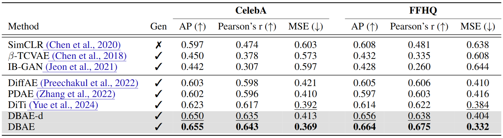
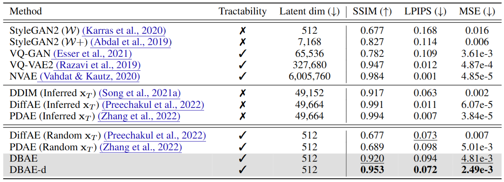

# [ICLR 2025 Spotlight] Diffusion Bridge AutoEncoders for Unsupervised Representation Learning (DBAE) <br><sub><sub>Official PyTorch implementation of DBAE </sub></sub>
**[Yeongmin Kim](https://sites.google.com/view/yeongmin-space), Kwanghyeon Lee,  Minsang Park, [Byeonghu Na](https://sites.google.com/view/byeonghu-na), [Il-Chul Moon](http://kaal.dsso.kr/bbs/board.php?bo_table=sub2_1&wr_id=3)**  

| [Openreview](https://openreview.net/forum?id=hBGavkf61a) | [arxiv](https://arxiv.org/pdf/2405.17111) | Poster | [CheckPoints](https://drive.google.com/drive/folders/1yuA3MJfIQUBF8U_f_l-8nKkUz6yzCeOO) |


## Dependencies
The requirements for this code are the same as [DDBM](https://github.com/alexzhou907/DDBM).

In our experiment, we utilized CUDA 11.4 and PyTorch 1.12.

## Datasets

1. For FFHQ, CelebA, CelebA-HQ, and LSUN datasets (LMDB format), please follow instructions from [DiffAE](https://github.com/phizaz/diffae). The directory structure looks like:
```
data
├─ffhq
|  ├─data.mdb
|  └lock.mdb
├─celebahq
|    ├─data.mdb
|    └lock.mdb
├─celeba
|    ├─data.mdb
|    └lock.mdb
├─bedroom
|    ├─data.mdb
|    └lock.mdb
├─horse
|    ├─data.mdb
|    └lock.mdb
```
2. Set your dataset path at args.sh.


## Model  training 

We provide the training bash file train_dbae.sh with dbae_train.py.
Set variables `DATASET_NAME` and `SCHEDULE_TYPE`:
- `DATASET_NAME` sets the dataset. We support FFHQ, CelebA, CelebA-HQ, and LSUN.
- `SCHEDULE_TYPE` sets forward diffusion. Set `ve` or `vp`. 

To train, run

```
bash train_dbae.sh $DATASET_NAME $SCHEDULE_TYPE
bash train_dbae.sh ffhq vp
bash train_dbae.sh celeba vp
```


## (Eval) Downstream Inference
We provide the code for downstream inference (regression/classification).

For regression, it needs to download [LFW datasets](https://drive.google.com/drive/folders/1jseAR1g1ckZxykS4OBpOTbPOjgsZSwrg). 

To evaluate regression capability (Pearson'r, MSE), run

```
bash infer_reg_dbae.sh ffhq vp {YOUR_PATH}/DBAE/ckpt/ffhq/sto/ema_0.9999_1020000.pt true
bash infer_reg_dbae.sh ffhq vp {YOUR_PATH}/DBAE/ckpt/ffhq/det/ema_0.9999_1020000.pt false
bash infer_reg_dbae.sh celeba vp {YOUR_PATH}/DBAE/ckpt/celeba/sto/ema_0.9999_980000.pt true
bash infer_reg_dbae.sh celeba vp {YOUR_PATH}/DBAE/ckpt/celeba/det/ema_0.9999_1020000.pt false
```

To evaluate classification capability (AP), run
```
bash infer_class_dbae.sh ffhq vp {YOUR_PATH}/DBAE/ckpt/ffhq/sto/ema_0.9999_1020000.pt true
bash infer_class_dbae.sh ffhq vp {YOUR_PATH}/DBAE/ckpt/ffhq/det/ema_0.9999_1020000.pt false
bash infer_class_dbae.sh celeba vp {YOUR_PATH}/DBAE/ckpt/celeba/sto/ema_0.9999_980000.pt true
bash infer_class_dbae.sh celeba vp {YOUR_PATH}/DBAE/ckpt/celeba/det/ema_0.9999_1020000.pt false
```

You can regenerate the results in Table 1 with [DBAE/ckpt](https://drive.google.com/drive/folders/1yuA3MJfIQUBF8U_f_l-8nKkUz6yzCeOO).

<p align="center">
  
</p>


## (Eval) Reconstruction

We provide the reconstruction bash file recon_dbae.sh with dbae_reconstruction.py.
Set variables `MODEL_PATH`, `CHURN_STEP_RATIO`, `RHO`, `GEN_SAMPLER`, `N`, and `STO` :
- `MODEL_PATH` sets your checkpoint path
- `CHURN_STEP_RATIO` sets SDE(0<, <1) or ODE (0) sampling. We recommend SDE to measure LPIPS and ODE for the other metrics.
- `RHO` sets time-discretization interval selection. 
- `GEN_SAMPLER` sets the order of the sampler.
- `N` sets sampling step number.
- `STO` is set to true if a stochastic encoder is used.

To reconstruction, run

```
bash recon_dbae.sh $DATASET_NAME $SCHEDULE_TYPE $MODEL_PATH $MODEL_PATH $CHURN_STEP_RATIO 1 train $RHO $GEN_SAMPLER $N $STO
bash recon_dbae.sh celebahq vp {YOUR_PATH}/DBAE/ckpt/ffhq/det/ema_0.9999_1020000.pt 0.0 1 train 7 euler 100 false
bash recon_dbae.sh celebahq vp {YOUR_PATH}/DBAE/ckpt/ffhq/det/ema_0.9999_1020000.pt 0.33 1 train 7 euler 333 false
bash recon_dbae.sh celebahq vp {YOUR_PATH}/DBAE/ckpt/ffhq/sto/ema_0.9999_1020000.pt 0.0 1 train 7 euler 100 false
bash recon_dbae.sh celebahq vp {YOUR_PATH}/DBAE/ckpt/ffhq/sto/ema_0.9999_1020000.pt 0.33 1 train 7 euler 333 false
```

To evaluate reconstruction, run

```
python3 eval_reconstruction.py --sample_path=$SAMPLE_PATH
python3 eval_reconstruction.py --sample_path={YOUR_PATH}/DBAE/ckpt/ffhq/det/sample_1020000/euler_7.0_100_w=1.0_churn=0.0
python3 eval_reconstruction.py --sample_path={YOUR_PATH}/DBAE/ckpt/ffhq/det/sample_1020000/heun_7.0_333_w=1.0_churn=0.33
python3 eval_reconstruction.py --sample_path={YOUR_PATH}/DBAE/ckpt/ffhq/sto/sample_1020000/euler_7.0_100_w=1.0_churn=0.0
python3 eval_reconstruction.py --sample_path={YOUR_PATH}/DBAE/ckpt/ffhq/sto/sample_1020000/heun_7.0_333_w=1.0_churn=0.33
```
You can regenerate the results in Table 2 with [DBAE/ckpt/ffhq](https://drive.google.com/drive/folders/1T_2ke133cMniY0EEO9cn0gQRPiwuszUc).

<p align="center">
  
</p>


## Interpolation
To interpolate two images (assets/img1.png and assets/img2.png), run

```
bash interpol_dbae.sh celebahq vp {YOUR_PATH}/DBAE/ckpt/ffhq/sto/ema_0.9999_1020000.pt 0.33 1 train 7 heun 167 true
```

<p align="center">
  
</p>


## Attribute Manipulation
It needs the trained linear classifier on attributes.

You can train your linear classifier with the infer_class_dbae.sh code. (The dataset could be changed.)

We provide the trained linear classifier ([best.pt](https://drive.google.com/drive/folders/1c5idDNZeaiUcS-qc6_7zRxbHiOh-cry-)) on 40 binary attributes of CelebA-HQ in the latent space of *ffhq/sto/ema_0.9999_1020000.pt*.

To manipulate attributes, run

```
bash manipul_dbae.sh celebahq vp {YOUR_PATH}/ffhq/sto/ema_0.9999_1020000.pt 0.33 1 train 7 heun 167 true
```

<p align="center">
  
</p>


## Reference
If you find the code useful for your research, please consider citing
```bib
@inproceedings{
kim2025diffusion,
title={Diffusion Bridge AutoEncoders for Unsupervised Representation Learning},
author={Yeongmin Kim and Kwanghyeon Lee and Minsang Park and Byeonghu Na and Il-chul Moon},
booktitle={The Thirteenth International Conference on Learning Representations},
year={2025},
url={https://openreview.net/forum?id=hBGavkf61a}
}
```

## Acknowledgements
This work is heavily built upon the code from
- *Zhou, L., Lou, A., Khanna, S., & Ermon, S. Denoising Diffusion Bridge Models. In The Twelfth International Conference on Learning Representations.*
- *Preechakul, K., Chatthee, N., Wizadwongsa, S., & Suwajanakorn, S. (2022). Diffusion autoencoders: Toward a meaningful and decodable representation. In Proceedings of the IEEE/CVF conference on computer vision and pattern recognition (pp. 10619-10629).*
- *Liu, B., Zhu, Y., Song, K., & Elgammal, A. (2020, October). Towards faster and stabilized gan training for high-fidelity few-shot image synthesis. In International conference on learning representations.*
- *Yue, Z., Wang, J., Sun, Q., Ji, L., Eric, I., Chang, C., & Zhang, H. Exploring Diffusion Time-steps for Unsupervised Representation Learning. In The Twelfth International Conference on Learning Representations.*

