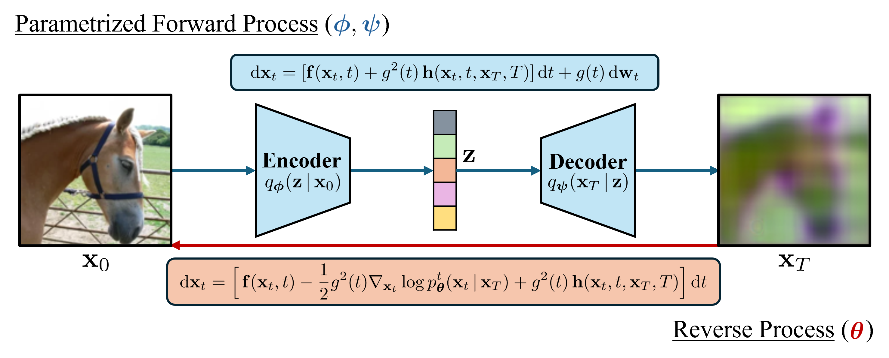

# [ICLR 2025 Spotlight] Diffusion Bridge AutoEncoders for Unsupervised Representation Learning (DBAE) <br><sub><sub>Official PyTorch implementation of DBAE </sub></sub>
**[Yeongmin Kim](https://sites.google.com/view/yeongmin-space), Kwanghyeon Lee,  Minsang Park, Byeonghu Na, Il-Chul Moon**  

| [Openreview](https://openreview.net/forum?id=hBGavkf61a) | [arxiv](https://arxiv.org/pdf/2405.17111) | Poster | [Check Point](https://drive.google.com/drive/folders/1yuA3MJfIQUBF8U_f_l-8nKkUz6yzCeOO)|





## Dependencies
The requirements for this code are the same as [DDBM](https://github.com/alexzhou907/DDBM).

In our experiment, we utilized CUDA 11.4 and PyTorch 1.12.

## Datasets

1. For FFHQ, CelebA, CelebA-HQ, and LSUN datasets (LMDB format), please follow instructions from [DiffAE](https://github.com/phizaz/diffae).
2. Set your dataset path at args.sh.


## Model  training 

We provide the training bash file train_dbae.sh with dbae_train.py.
Set variables `DATASET_NAME` and `SCHEDULE_TYPE`:
- `DATASET_NAME` sets the dataset. We support FFHQ, CelebA, CelebA-HQ, and LSUN.
- `SCHEDULE_TYPE` sets forward diffusion. Set `ve` or `vp. ' 

To train, run

```
bash train_dbae.sh $DATASET_NAME $SCHEDULE_TYPE
bash train_dbae.sh ffhq vp
```

<!--## Downstream Inference -->

## Reconstruction

We provide the reconstruction bash file recon_dbae.sh with dbae_reconstruction.py.
Set variables `MODEL_PATH`, `CHURN_STEP_RATIO`, `RHO`, `GEN_SAMPLER`, and `N` :
- `MODEL_PATH` sets your checkpoint path
- `CHURN_STEP_RATIO` sets SDE(0~1) or ODE (0) sampling.
- `RHO` sets time-discretization interval selection.
- `GEN_SAMPLER` sets the order of the sampler.
- `N` sets sampling step number.

To to reconstruction, run

```
bash recon_dbae.sh $DATASET_NAME $SCHEDULE_TYPE $MODEL_PATH $MODEL_PATH $CHURN_STEP_RATIO 1 train $RHO $GEN_SAMPLER $N
bash recon_dbae.sh ffhq vp {Your_Path}/DBAE/workdir/0.5_end_sto_k_latent_ffhq128_128_512d_vp/ema_0.9999_1020000.pt 0.0 1 train 7 euler 20
bash recon_dbae.sh ffhq vp {Your_Path}/DBAE/workdir/0.5_end_sto_k_latent_ffhq128_128_512d_vp/ema_0.9999_1020000.pt 0.33 1 train 7 heun 83
```

--## Disentanglment

## Unconditional Generation

## Interpolation

## Attribute Manipulation


## Reference
If you find the code useful for your research, please consider citing
```bib
@inproceedings{
kim2025diffusion,
title={Diffusion Bridge AutoEncoders for Unsupervised Representation Learning},
author={Yeongmin Kim and Kwanghyeon Lee and Minsang Park and Byeonghu Na and Il-chul Moon},
booktitle={The Thirteenth International Conference on Learning Representations},
year={2025},
url={https://openreview.net/forum?id=hBGavkf61a}
}
```

## Acknowledgements
This work is heavily built upon the code from
- *Zhou, L., Lou, A., Khanna, S., & Ermon, S. Denoising Diffusion Bridge Models. In The Twelfth International Conference on Learning Representations.*
- *Preechakul, K., Chatthee, N., Wizadwongsa, S., & Suwajanakorn, S. (2022). Diffusion autoencoders: Toward a meaningful and decodable representation. In Proceedings of the IEEE/CVF conference on computer vision and pattern recognition (pp. 10619-10629).*
- *Liu, B., Zhu, Y., Song, K., & Elgammal, A. (2020, October). Towards faster and stabilized gan training for high-fidelity few-shot image synthesis. In International conference on learning representations.*

